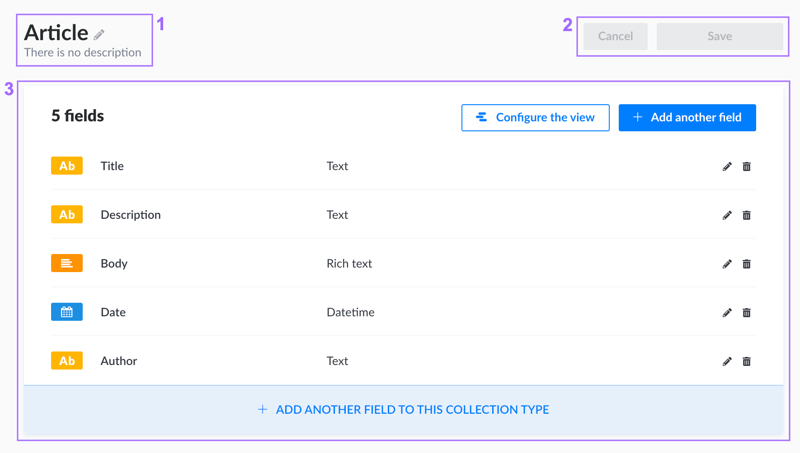

# Editing content types

The Content-Types Builder allows to edit any existing content type or component, even if it is already being used in the Content Manager. Editing a content type or component can include editing settings, but also adding, editing or deleting fields.

The right side of the Content-Types Builder interface, for any chosen content type or component, displays:

- the name, and optionally the description of the content type or component (1),
- buttons to cancel or save any ongoing modification (2),
- a table listing all the fields created and configured for the content type or component. From the fields table, it is possible to:
  - edit a field, by clicking on the edit button <Fa-PencilAlt />
  - delete a field, by clicking on the trash button <Fa-TrashAlt />
  - add another field to the content type or component, by clicking on the **Add another field** button
  - access the view configuration interface, by clicking on the **Configure the view** button (see Configuring content types views)

## Deleting a content type

Content types and components can be deleted through the Content-Types Builder. Deleting a content type automatically deletes all entries from the Content Manager that were based on that content type. The same goes for the deletion of a component, which is automatically deleted from every content type or entry where it was used.

To delete a content type or component:

1. In the Content-Types Builder navigation, click on the name of the content type or component to delete.
2. In the edition interface of the chosen content type or component, click on the edit button <Fa-PencilAlt /> on the right side of the content type's or component's name.
3. In the edition window, click on the **Delete** button.
4. In the confirmation window, confirm the deletion.

